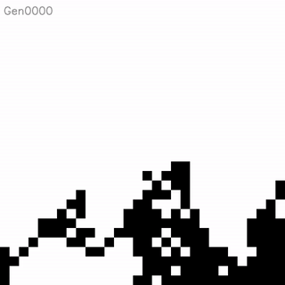

# The Genetic Art Forger

An experiment with genetic algorithms to draw an image starting from the bottom-left corner, without skipping any pixels (i.e. without lifting the pencil as an analogy). The results with the default parameters with a dynamic mutation rate are shown in the table below.

|                   Original                   |                  Evolution                   |                    Result                    |
| :------------------------------------------: | :------------------------------------------: | :------------------------------------------: |
|   |   |   |
|     |     |     |
|  |  |  |
|    |    |    |

Different approaches were tried, as explained below. Individuals in this context are basically paths (up, down, right, left) for the "pencil" to follow starting from the bottom-left corner.
## Elitism
- Individuals are created randomly and then sorted according to their `fitness`.
- The top-k individuals are chosen as parents and crossover is applied to them to complete the population.
- Mutation is applied to the newly created individuals, and those mutants are passed with their parents to the next generation.

## Probabilistic
- Individuals are created randomly and then sorted according to their `fitness`.
- `Fitness` values are accepted as weights and `k` parent are chosen according to a weighted probability from the population.
- Crossover is applied to the parents and the population is completed using mutants.
- The parents and the newly created mutants are passed on to the next generation.

## Other Experiments  
### Dynamic mutation  
The mutation rate can be decreased linearly. It reaches 0.01 after half the generations are passed.  
### Dynamic path length  
The path length can be increased starting from the diagonal length up to the path length set in the code.

## Results
Results of different experiments with different methods and hyperparameters are shown in the image below.

